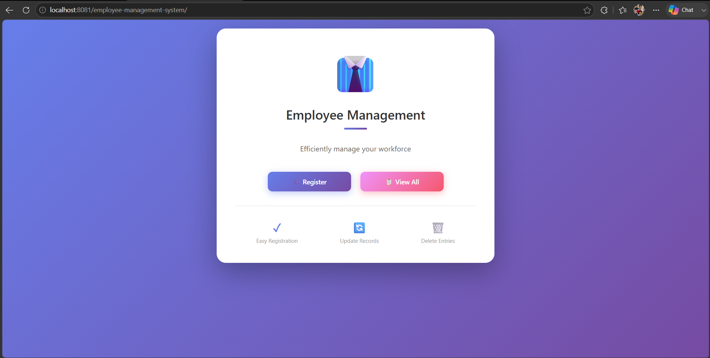
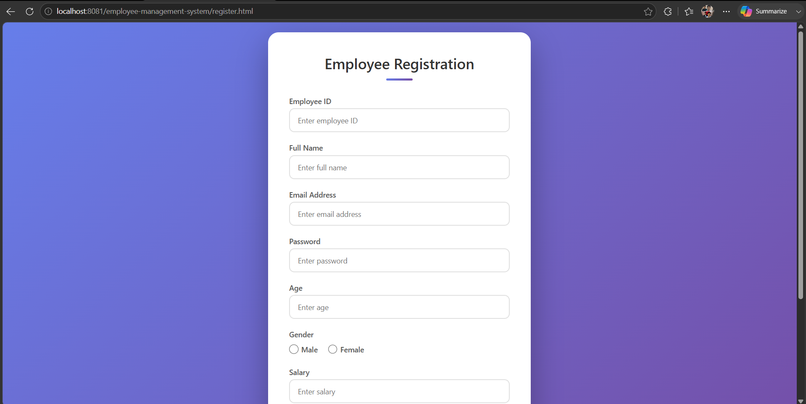
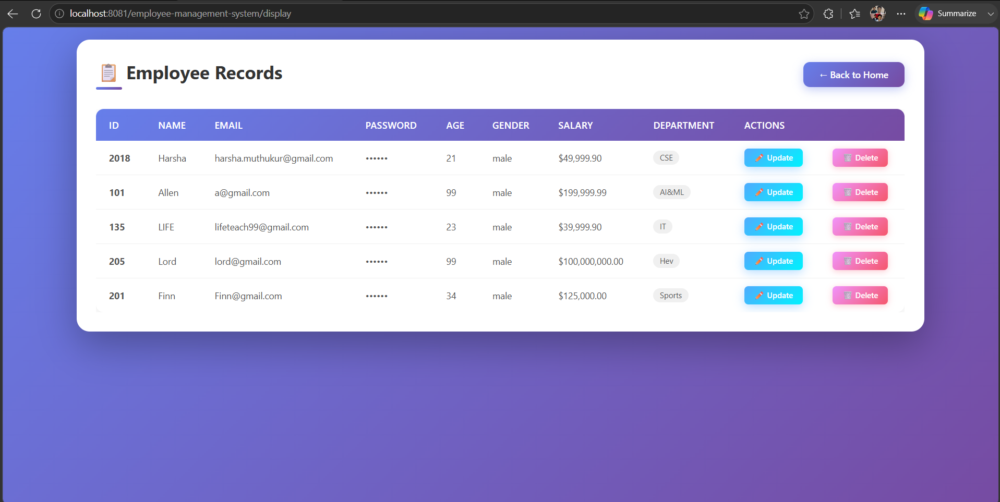
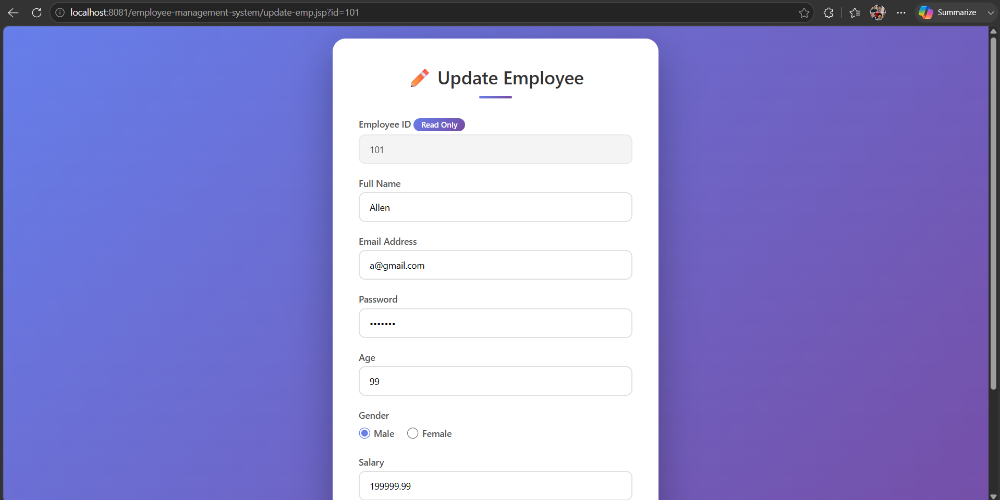

# Employee Management System


A simple Employee Management System developed using **Java Servlets**, **JSP**, **JDBC**, **PostgreSQL**, and **Maven**.

The application demonstrates the implementation of CRUD (Create, Read, Update, Delete) operations using the MVC architecture and follows the fundamentals of Java Web Development.

---

# Features

- Register a new employee
- View all employees
- Update employee details
- Delete employee records
- JDBC connectivity with PostgreSQL
- Maven-based project structure
- MVC architecture using Servlets and JSP

---

# Tech Stack

| Technology | Purpose |
|------------|---------|
| Java | Backend Programming |
| Jakarta Servlet | Request Handling |
| JSP | View Layer |
| JDBC | Database Connectivity |
| PostgreSQL | Database |
| Maven | Dependency Management |
| Apache Tomcat 10 | Servlet Container |

---

# Project Structure

```
employee-management-system
│
├── src
│   ├── main
│   │   ├── java
│   │   │   └── com.ty.employee_management_system
│   │   │       ├── connection
│   │   │       ├── controller
│   │   │       ├── dao
│   │   │       └── entity
│   │   │
│   │   ├── resources
│   │   └── webapp
│   │       ├── index.jsp
│   │       ├── home.jsp
│   │       ├── register.html
│   │       ├── display-emp.jsp
│   │       ├── update-emp.jsp
│   │       └── WEB-INF
│   │
│   └── test
│
├── pom.xml
└── README.md
```

---

# Project Architecture

```
Browser
    │
    ▼
JSP / HTML Pages
    │
    ▼
Servlet Controllers
    │
    ▼
Employee DAO
    │
    ▼
JDBC
    │
    ▼
PostgreSQL Database
```

---

# CRUD Operations

| Operation | Servlet |
|-----------|---------|
| Create Employee | RegisterEmployeeController |
| Read Employees | FetchEmployeeController |
| Update Employee | UpdateEmployeeController |
| Delete Employee | DeleteEmployeeController |

---

# Database

Database Name

```
employee-management-system
```

Example Connection

```java
String url = "jdbc:postgresql://localhost:5432/employee-management-system";
String username = "postgres";
String password = "your_password";
```

Update the database credentials according to your local PostgreSQL installation before running the application.

---

# Local Setup

## Clone Repository

```bash
git clone https://github.com/Harshavardhan3535/employee-management-system.git
```

---

## Navigate

```bash
cd employee-management-system
```

---

## Import Project

Import the project as an **Existing Maven Project** in Eclipse.

---

## Configure PostgreSQL

Create a PostgreSQL database:

```
employee-management-system
```

Update the database credentials inside

```
GetConnection.java
```

---

## Run

Deploy the project on

```
Apache Tomcat 10
```

Visit

```
http://localhost:8080/employee-management-system
```

---

# Screenshots

## 🏠 Home Page



---

## 📝 Register Employee



---

## 📋 Employee List



---

## ✏️ Update Employee



---

# Concepts Covered

- Java Servlets
- JSP
- MVC Architecture
- JDBC
- PostgreSQL
- CRUD Operations
- DAO Pattern
- HTTP Request & Response
- Form Handling
- SQL Queries
- Maven Project Structure
- Apache Tomcat Deployment

---

# Challenges Faced

### PostgreSQL Driver Issue

Several developers encountered HTTP 500 errors because the PostgreSQL driver was not being loaded correctly by Tomcat.

**Solution**

The PostgreSQL JDBC driver was added to:

```
WEB-INF/lib
```

allowing Tomcat to load the driver successfully during deployment.

---

# Future Improvements

- Login Authentication
- Session Management
- Search Employees
- Pagination
- Input Validation
- Role-Based Access Control
- Spring Boot Migration
- REST API Version
- Docker Deployment

---

# Learning Outcome

This project helped me understand how Java web applications work using Servlets, JSP, JDBC, and PostgreSQL.

It strengthened my understanding of the MVC architecture, request handling, database connectivity, CRUD operations, and deploying Java web applications on Apache Tomcat.

This project also served as a foundation before transitioning to Spring Boot and REST API development.

---

# Author

**Harsha Vardhan**

GitHub: https://github.com/Harshavardhan3535
